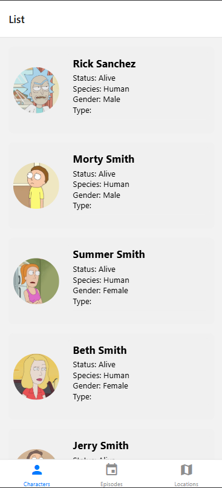
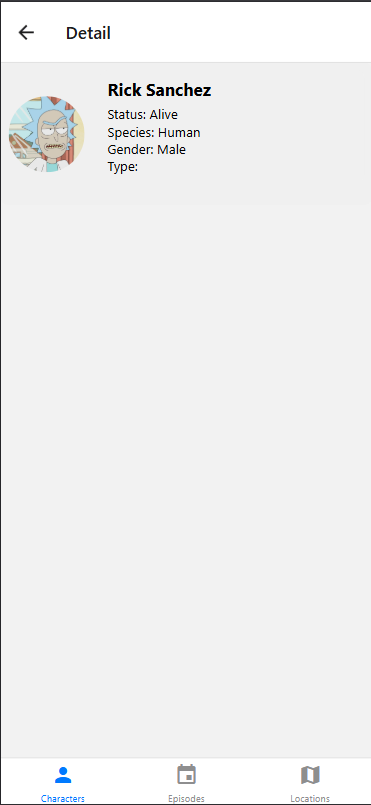
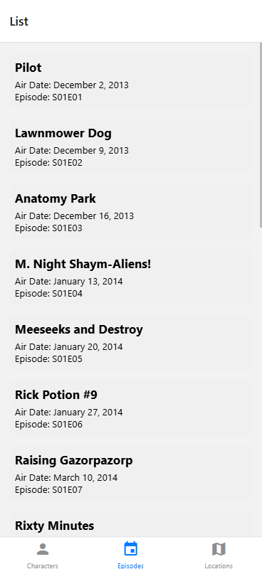
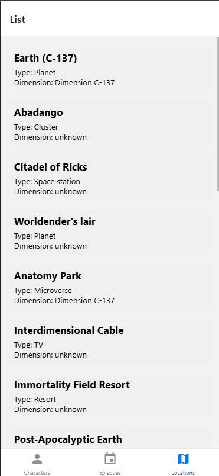

# Rick and Morty App (React Native)

This is a **React Native** application that fetches and displays information about characters from the *Rick and Morty* universe. The app utilizes **React Navigation**, **Axios**, and the **Rick and Morty API** to provide a smooth experience.

## 🚀 Features
- **Character List**: View a list of characters with images and basic details.
- **Character Details**: See full information about each character.
- **Navigation**: Bottom tab navigation for easy access.
- **API Integration**: Fetches real-time data from the [Rick and Morty API](https://rickandmortyapi.com/).

## 🛠 Tech Stack
- **Frontend**: React Native
- **Navigation**: React Navigation
- **HTTP Requests**: Axios
- **State Management**: React Hooks

## 📦 Installation
### Prerequisites
Ensure you have **Node.js** and **npm** installed

### Clone the repository
```sh
git clone https://github.com/Derek486/rn-rick-and-morty-app.git
cd rn-rick-and-morty-app
```

### Install dependencies
```sh
npm install
```

### Run the app
For Android:
```sh
npm run android
```
For iOS (Mac only):
```sh
npm run ios
```
For Web:
```sh
npm run web
```

## 📂 Project Structure
```
rn-rick-and-morty-app/
│── src/
│   │── api/
│   │── hooks/
│   │── models/
│   │── navigation/
│   │── screens/
│   │── services/
│   │── styles/
│   │── types/
│── assets/
│── App.js
│── package.json
│── README.md
```

## 📸 Preview
### Character List



### Character Details



### Episode List



### Location List



## 📜 License
This project is licensed under the **MIT License**. Feel free to use and modify it!